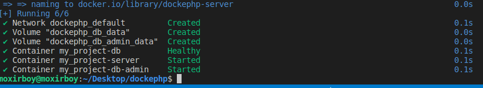

# LAMP-DOCKER
 LAMP DOCKER SETUP WITH PHP 8 AND MARIADB FOR SYMFONY, LARAVEL AND YII2 PROJECTS

Structure of Directories:
```
.
├── src/
└── docker/
    ├── db/
    │   └── mariadb/
    │       └── my.cnf
    └── server/
        ├── apache/
        │   └── sites-enabled/
        │       └── site.conf
        ├── php/
        │   └── php.ini
        └── Dockerfile
├── .env
└── compose.yaml
```

instead of apache we can use another server.

src contains code of project. in docker configuration of project. .env hold environment variables.

compose.yaml

```docker
version: '3.9'
services:
server:
build:
context: .
dockerfile: ./docker/server/Dockerfile # Указываем путь к файлу Dockerfile
container_name: '${APP_NAME}-server' # Указываем имя контейнера
ports:
- '${APP_PORT}:80' # Порт, по которому сервис будет доступен снаружи:внутри контейнера
working_dir: /var/www/html # Рабочая директория внутри контейнера
environment:
- 'DATABASE_URL=mysql://${MYSQL_USER}:${MYSQL_PASS}@db_server:3306/${MYSQL_DB}?serverVersion=${MYSQL_VER}'
volumes:
- ./src:/var/www/html # Сопоставление директории src в корне проекта с рабочей директорией сервера
- ./docker/server/apache/sites-enabled:/etc/apache2/sites-enabled # Конфигурация сайтов
- ./docker/server/php/php.ini:/usr/local/etc/php/conf.d/extra-php-config.ini # ini-файл с необходимыми нам настройками PHP
```

look at volumes!! <path to local directory>:<path to inner container directory>. if you give like this. docker will take files in your local directory and put it in his own container place that was indicated as second. Their names should match.

docker/server/Docker

```docker
FROM php:8.3-apache
RUN a2enmod rewrite && \
curl -sSLf \
-o /usr/local/bin/install-php-extensions \
[https://github.com/mlocati/docker-php-extension-installer/releases/latest/download/install-php-extensions](https://github.com/mlocati/docker-php-extension-installer/releases/latest/download/install-php-extensions) && \
chmod +x /usr/local/bin/install-php-extensions && \
install-php-extensions gd pdo_mysql bcmath zip intl opcache @composer
```

```docker
APP_NAME=my_project
APP_PORT=8101
APP_DB_ADMIN_PORT=8102
DB_PORT=33016

MYSQL_ROOT_PASS=root
MYSQL_USER=user
MYSQL_PASS=pass
MYSQL_DB=test_db # База данных, которая будет создана при первоначальном запуске проекта
MYSQL_VER=10.11 # Версия MariaDB
```

let`s now write configuretion for apache

docker/server/apache/sites-enabled/site.conf

```docker
<VirtualHost *:80>
  DocumentRoot /var/www/html/public
  <Directory /var/www/html/public>
      AllowOverride None
      Order Allow,Deny
      Allow from All

      <IfModule mod_rewrite.c>
          Options -MultiViews
          RewriteEngine On
          RewriteCond %{REQUEST_FILENAME} !-f
          RewriteRule ^(.*)$ index.php [QSA,L]
      </IfModule>
  </Directory>
</VirtualHost>
```

full docker file code:

```docker
  db_server:
    image: mariadb:${MYSQL_VER}
    container_name: '${APP_NAME}-db'
    restart: always
    ports:
      - '${DB_PORT}:3306'
    environment:
      MYSQL_ROOT_PASSWORD: '${MYSQL_ROOT_PASS}'
      MYSQL_USER: '${MYSQL_USER}'
      MYSQL_PASSWORD: '${MYSQL_PASS}'
      MYSQL_DATABASE: '${MYSQL_DB}'
    volumes:
      - db_data:/var/lib/mysql
      - ./docker/db/mariadb/my.cnf:/etc/mysql/conf.d/my.cnf
    healthcheck:
      test: mysqladmin ping -h 127.0.0.1 -u root --password=$$MYSQL_ROOT_PASSWORD
      interval: 5s
      retries: 5

  db_admin:
    image: adminer
    container_name: '${APP_NAME}-db-admin'
    ports:
      - '${APP_DB_ADMIN_PORT}:8080'
    environment:
      - ADMINER_DEFAULT_SERVER=db_server
      - ADMINER_DESIGN=lucas-sandery
    depends_on:
      db_server:
        condition: service_healthy
    volumes:
      - db_admin_data:/var/www/html

volumes:
  db_data:
  db_admin_data:
```

lets run docker

```bash
docker compose up -d
```




they are appearing on ports :8101 and :8102
so now let write some code


we need to create public directory inside src and after index.php. path should look like this 
src/public/index.php


lets print info of php 

```php
<?php phpinfo();
```


Now for installing framework we need to go inside container after delete all files in var/www/html

going inside container:

```docker
docker compose exec server bash
```


deleting files of var/www/html

```bash
ls -A1 | xargs rm -rf
```


look at src file there is nothing because we deleted all files.

Now if we want to install symfony we should do this

```bash
composer create-project symfony/website-skeleton .
```


If we want to install laravel we should do this

```bash
composer create-project laravel/laravel .
```


lets do it with yii2 basic

```bash
composer create-project --prefer-dist yiisoft/yii2-app-basic .
```


Dont forget to rename web to public because we configured apache to look index.php in public


give permission for assets and runtime 

```bash
chmod -R 777 public/assets && chmod -R 777 runtime
```


